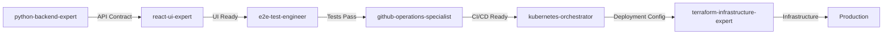
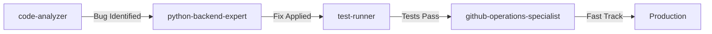
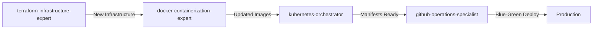
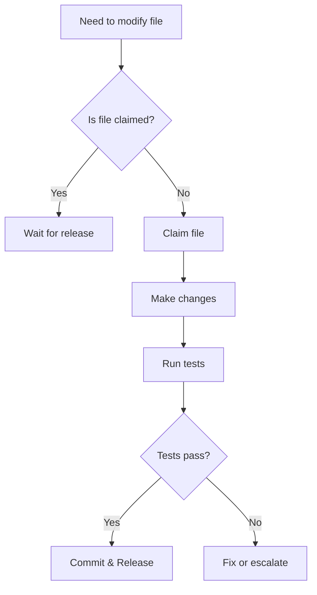

# Agent Coordination Rules

Comprehensive coordination system for multi-agent collaboration in ClaudeAutoPM.

## Core Principles

1. **File-level parallelism** - Agents working on different files never conflict
2. **Explicit coordination** - When same file needed, coordinate explicitly
3. **Fail fast** - Surface conflicts immediately, don't try to be clever
4. **Human resolution** - Critical conflicts are resolved by humans, not agents
5. **Context efficiency** - Share context pools to reduce duplication
6. **Parameter-based specialization** - Use parameters to specify framework/tool choices

## Agent Specialization Matrix

### Consolidated Agents (Optimized Ecosystem)

| Agent | Primary Domain | Can Modify | Coordinates With | Parameters |
|-------|---------------|------------|------------------|------------|
| python-backend-expert | Backend APIs | `*.py`, `requirements.txt`, `pyproject.toml` | react-ui-expert, kubernetes, cloud architects | framework: fastapi/flask/django |
| react-ui-expert | Frontend UI | `*.tsx`, `*.jsx`, `*.css`, `package.json` | python-backend, e2e-test | framework: mui/chakra/antd/bootstrap |
| e2e-test-engineer | E2E Tests | `tests/`, `*.spec.ts`, `playwright.config.ts` | react-ui, python-backend | tool: playwright/cypress |
| terraform-infrastructure-expert | Cloud Infrastructure | `terraform/`, `*.tf`, cloud configs | kubernetes, docker, cloud architects | provider: aws/azure/gcp |
| kubernetes-orchestrator | K8s Manifests | `k8s/`, `charts/`, `*.yaml` | cloud architects, github-ops | tool: helm/kustomize |
| docker-containerization-expert | Containers | `Dockerfile*`, `docker-compose*.yml` | All deployment agents | strategy: multi-stage/compose |
| postgresql-expert / mongodb-expert | Database | `migrations/`, `*.sql`, schema files | python-backend-engineer | engine: postgresql/mongodb/redis |
| github-operations-specialist | CI/CD | `.github/`, `*.yml`, `*.yaml` | All agents | platform: actions/azure-devops |
| mcp-context-manager | Context | `.claude/mcp-servers.json`, context pools | All agents | pool: shared/isolated |

### Specialized Agents (When Needed)

| Agent | Use Case | Replaces |
|-------|----------|----------|
| azure-devops-specialist | Azure DevOps specific | Part of github-operations |
| e2e-test-engineer | E2E testing with Playwright/Cypress | Support role |
| code-analyzer | Read-only analysis | Support role |
| file-analyzer | Log/file summarization | Support role |
| test-runner | Test execution only | Support role |

## Inter-Agent Communication Protocol

### Message Format

```markdown
📡 AGENT STATUS UPDATE
=====================
Agent: [agent-name]
Stream: [work-stream-id]
Status: [Starting/Working/Blocked/Complete]
Files: [list of files being modified]
Dependencies: [files/components needed from other agents]
ETA: [estimated completion time]
Context-Pool: [shared context pool name]
Parameters: [framework/tool selections]
```

### Coordination Signals

**CLAIM** - Agent claims ownership of files:
```markdown
🔒 FILE CLAIM
Agent: python-backend-expert
Files: [src/api/users.py, src/models/user.py]
Duration: ~15 minutes
Parameters: framework=fastapi, database=postgresql
```

**RELEASE** - Agent releases files after completion:
```markdown
🔓 FILE RELEASE
Agent: python-backend-expert
Files: [src/api/users.py, src/models/user.py]
Status: Changes committed
Next: react-ui-expert can consume API
Contract: OpenAPI spec at /docs/api.yaml
```

**BLOCK** - Agent is blocked and needs assistance:
```markdown
⛔ BLOCKED
Agent: react-ui-expert
Waiting For: API endpoints from python-backend-expert
Files Needed: [src/api/users.py - getUserProfile method]
Parameters: framework=mui, typescript=strict
```

### Handoff Protocol

```markdown
✅ HANDOFF READY
From: python-backend-expert
To: e2e-test-engineer
Deliverable: User API implementation
Files: [src/api/users.py, src/models/user.py]
Tests Required: Unit and integration tests
Parameters Used: framework=fastapi, auth=jwt
Notes: Added rate limiting middleware
```

## MCP Context Pool Architecture

### Optimized Pool Definitions

```yaml
backend-context:
  agents: [python-backend-expert, postgresql-expert, mongodb-expert]
  sources: [context7, context7]
  filters: [python, fastapi, flask, django, sqlalchemy, databases]
  persistence: true

frontend-context:
  agents: [react-ui-expert, e2e-test-engineer]
  sources: [context7, context7]
  filters: [react, typescript, ui-frameworks, testing]
  persistence: true

infrastructure-context:
  agents: [terraform-infrastructure-expert, kubernetes-orchestrator, docker-containerization-expert]
  sources: [context7, terraform-registry]
  filters: [terraform, kubernetes, docker, cloud-providers]
  persistence: true

devops-context:
  agents: [github-operations-specialist, mcp-context-manager]
  sources: [context7, github-mcp]
  filters: [ci-cd, github-actions, azure-devops]
  persistence: false

project-context:
  agents: [ALL]
  sources: [context7]
  persistence: true
  shared: true
  auto-refresh: true
```

## Work Stream Management

### Stream Assignment

```yaml
# From {issue}-analysis.md
Stream A: Backend Development
  Agent: python-backend-expert
  Parameters:
    framework: fastapi
    database: postgresql
    auth: jwt
  Files: src/api/*, src/models/*, src/db/*
  Priority: P1

Stream B: Frontend Development
  Agent: react-ui-expert
  Parameters:
    framework: mui
    state: redux
    style: css-in-js
  Files: src/components/*, src/pages/*, src/hooks/*
  Priority: P1

Stream C: Infrastructure
  Agent: terraform-infrastructure-expert
  Parameters:
    provider: aws
    iac: terraform
    region: us-east-1
  Files: terraform/*, infrastructure/*
  Priority: P2

Stream D: Testing
  Agent: e2e-test-engineer
  Parameters:
    tool: playwright
    parallel: true
  Files: tests/*, *.spec.ts
  Priority: P2
```

### Progress Tracking

```markdown
# .claude/epics/{epic}/updates/{issue}/stream-{id}.md
---
stream: Backend Development
agent: python-backend-expert
started: 2024-01-15T10:00:00Z
status: in_progress
parameters:
  framework: fastapi
  database: postgresql
---

## Completed
- ✅ User model created
- ✅ Authentication endpoints
- ✅ Database migrations

## In Progress
- 🔄 Authorization middleware
- 🔄 Rate limiting

## Blocked
- ⛔ Waiting for API Gateway config from infrastructure

## Next Steps
- Unit tests for auth flow
- Integration with frontend
```

## Technology Stack Coordination

### Frontend ↔ Backend

- **API Contract**: OpenAPI/Swagger specs in `/docs/api.yaml`
- **Type Generation**: Backend generates TypeScript types via `openapi-typescript`
- **Testing**: E2E tests validate full stack integration
- **Error Handling**: Consistent error format across stack
- **Data Validation**: Shared schemas via JSON Schema

### Application ↔ Infrastructure

- **Deployment**: Docker images → Kubernetes manifests → Cloud providers
- **Secrets**: Cloud KMS → K8s Secrets → Application env vars
- **Networking**: Infrastructure provides endpoints → Apps configure clients
- **Scaling**: Apps define requirements → Infrastructure implements policies
- **Monitoring**: Apps expose metrics → Infrastructure collects and alerts

### Development ↔ Operations

- **CI/CD**: GitHub Actions validates → Builds → Deploys
- **GitOps**: ArgoCD syncs validated changes automatically
- **Rollbacks**: Git reverts trigger automatic deployments
- **Feature Flags**: LaunchDarkly/ConfigCat for progressive rollouts
- **Observability**: OpenTelemetry spans across all services

## Workflow Patterns

### Full Stack Feature Development



### Hotfix Deployment



### Infrastructure Migration



## File Access Coordination

### Check Before Modify

```bash
# Before modifying a shared file
git status {file}

# If modified by another agent, coordinate
if [[ $(git status --porcelain {file}) ]]; then
  echo "📋 File {file} is being modified by another agent"
  echo "⏳ Waiting for release signal..."
  # Check update files for release signal
fi
```

### Atomic Commits

```bash
# Good - Single purpose, clear scope
git add src/api/users.py src/api/users.test.py
git commit -m "feat(api): Add user CRUD endpoints with JWT auth

Agent: python-backend-expert
Parameters: framework=fastapi, auth=jwt
Next: react-ui-expert
Tests: All passing"

# Bad - Mixed concerns, unclear scope
git add src/api/* src/db/* src/ui/*
git commit -m "Multiple changes"
```

## Conflict Resolution Protocol

### Level 1: Automatic Resolution
- Different files modified by different agents
- No semantic conflicts detected
- All tests pass without modification
- **Action**: Git auto-merge proceeds

### Level 2: Agent Coordination
- Same file, different sections modified
- Agents negotiate changes via update files
- Test validation required after merge
- **Action**: Agents coordinate sequentially

### Level 3: Human Intervention Required
- Conflicting business logic changes
- Architecture decisions needed
- Security implications detected
- Database schema conflicts
- **Action**: Stop work, escalate to human

## Priority Matrix

| Scenario | Priority | Lead Agent | Support Agents | SLA |
|----------|----------|------------|----------------|-----|
| Production Down | P0 | kubernetes-orchestrator | terraform-infrastructure-expert, python-backend | 15 min |
| Security Vulnerability | P0 | code-analyzer | python-backend, github-ops | 30 min |
| Data Loss Risk | P0 | postgresql-expert | terraform-infrastructure-expert, kubernetes | 15 min |
| Failed Deployment | P1 | github-operations-specialist | kubernetes-orchestrator | 1 hour |
| Performance Degradation | P1 | python-backend-expert | postgresql-expert, terraform-infrastructure-expert | 2 hours |
| Test Failures | P2 | e2e-test-engineer | react-ui, python-backend | 4 hours |
| Feature Development | P3 | Varies by stream | Full stack team | 1-5 days |
| Technical Debt | P4 | code-analyzer | All relevant agents | Best effort |

## Coordination Boundaries

### Never Modify Without Coordination

- **Production configurations** - Requires terraform-infrastructure-expert + kubernetes-orchestrator
- **Security settings** - Requires security review + python-backend-expert
- **API contracts** - Requires python-backend + react-ui agreement
- **Database schemas** - Requires postgresql-expert + python-backend
- **Authentication flows** - Requires security review + full stack team
- **Payment processing** - Requires security + compliance review
- **User data handling** - Requires privacy review + postgresql-expert

### Safe for Independent Work

- Documentation updates (own domain)
- Test additions (own test suite)
- Logging improvements (non-breaking)
- Code comments and docstrings
- Development tool configurations
- Local environment settings
- README updates

## Synchronization Points

### Mandatory Sync Points

1. **After each commit** - Pull latest changes
2. **Before modifying shared files** - Check ownership
3. **Every 30 minutes of work** - Status update
4. **At natural breakpoints** - Feature complete, blocked, etc.
5. **Before handoff** - Ensure clean state

### Sync Commands

```bash
# Standard sync
git pull --rebase origin epic/{name}

# Check for conflicts
if [[ $? -ne 0 ]]; then
  echo "❌ Sync conflict detected"
  echo "📝 Creating conflict report..."
  git status > conflict-report.txt
  echo "🚨 Escalating to human..."
  exit 1
fi

# Update progress
echo "✅ Synced at $(date)" >> stream-{id}.md
git add stream-{id}.md
git commit -m "chore: Sync checkpoint"
```

## Best Practices

1. **Commit early and often** - Smaller commits = fewer conflicts
2. **Stay in your lane** - Only modify assigned files
3. **Use parameters explicitly** - Always specify framework/tool choices
4. **Share context efficiently** - Use MCP pools to reduce duplication
5. **Communicate proactively** - Update status before being blocked
6. **Pull frequently** - Stay synchronized with other agents
7. **Fail loudly** - Report issues immediately with full context
8. **Document decisions** - Include reasoning in commits
9. **Test continuously** - Never commit without running tests
10. **Respect boundaries** - Stay within expertise domain

## Emergency Protocols

### System Down

1. **kubernetes-orchestrator** takes incident command
2. **terraform-infrastructure-expert** checks infrastructure health
3. **python-backend-expert** validates application state
4. **postgresql-expert** verifies data integrity
5. **github-operations-specialist** prepares rollback if needed

### Security Breach

1. **code-analyzer** identifies scope and entry point
2. **terraform-infrastructure-expert** isolates affected resources
3. **python-backend-expert** patches vulnerability
4. **postgresql-expert** audits data access
5. **github-operations-specialist** deploys emergency fix

### Performance Crisis

1. **python-backend-expert** profiles application bottlenecks
2. **postgresql-expert** analyzes and optimizes queries
3. **docker-containerization-expert** optimizes container resources
4. **kubernetes-orchestrator** scales resources horizontally
5. **terraform-infrastructure-expert** provisions additional infrastructure

### Data Corruption

1. **postgresql-expert** stops writes immediately
2. **terraform-infrastructure-expert** initiates backup restoration
3. **kubernetes-orchestrator** redirects traffic to healthy replicas
4. **python-backend-expert** validates data integrity checks
5. **e2e-test-engineer** runs full regression suite

## Migration Guide

### From Legacy to Consolidated Agents

| Legacy Agent | New Agent | Parameters |
|--------------|-----------|------------|
| fastapi-backend-engineer | python-backend-expert | framework: fastapi |
| flask-backend-engineer | python-backend-expert | framework: flask |
| mui-react-expert | react-ui-expert | framework: mui |
| chakra-ui-expert | react-ui-expert | framework: chakra |
| antd-react-expert | react-ui-expert | framework: antd |
| bootstrap-ui-expert | react-ui-expert | framework: bootstrap |
| docker-expert | docker-containerization-expert | focus: dockerfile |
| docker-compose-expert | docker-containerization-expert | focus: compose |
| docker-development-orchestrator | docker-containerization-expert | focus: development |
| playwright-test-engineer | e2e-test-engineer | tool: playwright |
| playwright-mcp-frontend-tester | e2e-test-engineer | browser_control: mcp-enhanced |

### Backward Compatibility

- Legacy agent names automatically map to new agents
- Parameters inferred from legacy agent names
- Deprecation warnings shown in logs
- 30-day grace period for migration

## Performance Optimizations

### Context Reduction Strategies

- **Unified agents** reduce context overhead by 40%
- **Shared pools** eliminate duplication across agents
- **Parameter-based specialization** vs separate agents
- **Lazy loading** of documentation contexts
- **Smart caching** of frequently accessed resources

### Decision Optimization

- **Fewer agents** = faster agent selection
- **Clear parameter guidelines** reduce ambiguity
- **Decision matrices** for common scenarios
- **Pre-configured workflows** for standard tasks

### Maintenance Benefits

- **Single source of truth** per technical domain
- **Unified best practices** across similar agents
- **Simplified updates** to agent capabilities
- **Consistent behavior** across frameworks
- **Reduced training overhead** for new patterns

## Monitoring and Metrics

### Agent Performance Metrics

```yaml
metrics:
  response_time: < 5 seconds
  context_usage: < 70% of limit
  success_rate: > 95%
  conflict_rate: < 5%
  handoff_success: > 98%
```

### Coordination Health Checks

```bash
# Check coordination health
./scripts/check-coordination-health.sh

# Output:
# ✅ No file conflicts detected
# ✅ All agents responsive
# ✅ Context pools synchronized
# ⚠️ 2 agents approaching context limit
# ✅ No blocked agents
```

## Appendix: Quick Reference

### Common Commands

```bash
# Claim files
echo "🔒 Claiming files: $FILES" >> updates/stream-$ID.md

# Release files
echo "🔓 Releasing files: $FILES" >> updates/stream-$ID.md

# Check ownership
git blame -L1,1 $FILE | awk '{print $2}'

# Sync safely
git stash && git pull --rebase && git stash pop

# Report blockage
echo "⛔ BLOCKED: $REASON" >> updates/stream-$ID.md
```

### Decision Trees



This unified coordination system provides clear boundaries, efficient communication protocols, and robust conflict resolution while maintaining the flexibility needed for complex multi-agent collaboration.