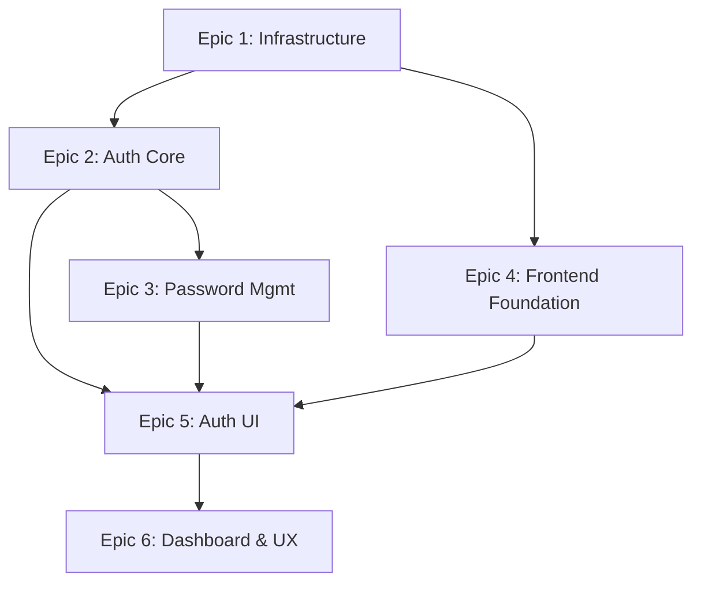

# Multi-Epic Breakdown Example: Frontend-Backend-DB-Base

## Original PRD: MUI + FastAPI + PostgreSQL + TDD

Ta sama PRD może być podzielona na **6 logicznych epiców** zamiast jednego:

---

## Epic 1: Infrastructure Foundation
**Priorytet:** P0 (Blokujący)
**Czas:** 1 tydzień
**Zależności:** Brak

### Zakres:
- Docker setup (multi-stage builds)
- Docker Compose dla dev/prod
- Monorepo struktura (pnpm + uv/poetry)
- PostgreSQL setup z pgBouncer
- Redis setup (opcjonalnie)
- Health checks i monitoring podstawowy
- Environment configuration (.env)

### Zadania (7):
1. Setup monorepo structure
2. Create Docker configurations
3. Setup PostgreSQL with migrations
4. Configure Redis (optional)
5. Setup development environment
6. Create health check endpoints
7. Configure logging infrastructure

---

## Epic 2: Authentication Core (Backend)
**Priorytet:** P0
**Czas:** 2 tygodnie
**Zależności:** Epic 1

### Zakres:
- User model i migracje (Alembic)
- JWT + refresh token implementation
- Registration endpoint
- Login/logout endpoints
- Token refresh mechanism
- Password hashing (Argon2)
- RBAC (roles: user, admin)

### Zadania (10):
1. Create user database models
2. Setup Alembic migrations
3. Implement JWT token service
4. Create registration endpoint
5. Create login endpoint
6. Implement refresh token rotation
7. Setup RBAC system
8. Add token revocation
9. Create logout endpoint
10. Write auth middleware

---

## Epic 3: Password Management
**Priorytet:** P0
**Czas:** 1 tydzień
**Zależności:** Epic 2

### Zakres:
- Forgot password flow
- Reset password via token
- Change password (logged in)
- Password complexity rules
- Password history
- Rate limiting for password operations

### Zadania (6):
1. Create password reset token model
2. Implement forgot password endpoint
3. Create reset password endpoint
4. Implement change password endpoint
5. Add password validation rules
6. Setup rate limiting

---

## Epic 4: Frontend Foundation
**Priorytet:** P0
**Czas:** 1.5 tygodnia
**Zależności:** Epic 1

### Zakres:
- React 18 + TypeScript setup
- Vite configuration
- MUI theme setup
- React Router configuration
- Zustand state management
- i18n setup (en/pl)
- API client setup

### Zadania (8):
1. Setup React with Vite
2. Configure TypeScript
3. Setup MUI theme (light/dark)
4. Configure React Router
5. Setup Zustand store
6. Create API client service
7. Setup i18n
8. Configure form validation (react-hook-form + zod)

---

## Epic 5: Authentication UI
**Priorytet:** P0
**Czas:** 2 tygodnie
**Zależności:** Epic 2, Epic 3, Epic 4

### Zakres:
- Sign in screen
- Sign up screen
- Forgot password screen
- Reset password screen
- Change password component
- Auth state management
- Protected routes
- Session management

### Zadania (10):
1. Create sign in component
2. Create sign up component
3. Implement forgot password UI
4. Create reset password screen
5. Build change password form
6. Setup auth context/store
7. Implement protected routes
8. Add session persistence
9. Create auth interceptors
10. Handle auth errors UI

---

## Epic 6: Dashboard & User Experience
**Priorytet:** P1
**Czas:** 2 tygodnie
**Zależności:** Epic 5

### Zakres:
- Post-login layout (AppBar, Drawer)
- Dashboard with metrics cards
- User profile page
- Avatar management
- Navigation system
- Breadcrumbs
- User preferences
- Sign out functionality

### Zadania (9):
1. Create app layout shell
2. Build navigation drawer
3. Implement app bar with user menu
4. Create dashboard page
5. Build metrics cards
6. Create user profile page
7. Add avatar upload
8. Setup breadcrumbs
9. Implement sign out

---

## Relacje między epicami:



## Zalety podziału na wiele epiców:

### 1. **Równoległość pracy**
- Epic 2 (Backend Auth) i Epic 4 (Frontend Foundation) mogą być robione równolegle
- Różne zespoły mogą pracować nad różnymi epicami

### 2. **Lepsza widoczność postępów**
- Każdy epic ma jasny cel i deliverables
- Łatwiej śledzić, co jest gotowe

### 3. **Elastyczność priorytetów**
- Można dostarczyć MVP z epicami 1-3 (tylko backend API)
- Frontend (epicy 4-6) może być dodany później

### 4. **Zarządzanie ryzykiem**
- Problemy w jednym epicu nie blokują całości
- Można re-priorytetyzować epicy w razie potrzeby

### 5. **Lepsze estymaty**
- Mniejsze, bardziej precyzyjne epicy = dokładniejsze estymaty
- Łatwiej planować sprinty

---

## Jak to zaimplementować w systemie PM:

### Opcja 1: Rozszerzyć `prd-parse.js`
```javascript
// Analiza złożoności PRD
const analyzeComplexity = (prdContent) => {
  const components = countComponents(prdContent);
  const features = countFeatures(prdContent);

  if (components > 5 || features > 10) {
    return 'multi-epic';
  }
  return 'single-epic';
};

// Podział na epicy
const splitIntoEpics = (prdContent) => {
  const epics = [];

  // Identyfikuj główne obszary
  if (hasInfrastructure(prdContent)) {
    epics.push(createInfraEpic());
  }
  if (hasAuthentication(prdContent)) {
    epics.push(createAuthEpic());
  }
  if (hasFrontend(prdContent)) {
    epics.push(createFrontendEpic());
  }

  return epics;
};
```

### Opcja 2: Manual split command
```bash
# Nowa komenda do ręcznego podziału
pm epic-split frontend-backend-db-base

# Interaktywnie pyta:
# - Ile epiców chcesz utworzyć?
# - Nazwy epiców
# - Zależności między nimi
```

### Opcja 3: YAML config w PRD
```yaml
# W frontmatter PRD
---
epics:
  - name: infrastructure
    priority: P0
    weeks: 1
  - name: auth-backend
    priority: P0
    weeks: 2
    depends_on: [infrastructure]
  - name: auth-frontend
    priority: P0
    weeks: 2
    depends_on: [infrastructure]
---
```

---

## Struktura folderów dla multi-epic:

```
.opencode/epics/
├── frontend-backend-db-base/           # Główny folder dla PRD
│   ├── meta.yaml                       # Metadane o wszystkich epicach
│   ├── infrastructure/                 # Epic 1
│   │   ├── epic.md
│   │   ├── 001.md
│   │   ├── 002.md
│   │   └── ...
│   ├── auth-backend/                   # Epic 2
│   │   ├── epic.md
│   │   └── tasks/
│   ├── password-management/            # Epic 3
│   │   ├── epic.md
│   │   └── tasks/
│   └── ...
```

## Podsumowanie

Podział PRD na wiele epiców daje:
- ✅ Lepszą organizację pracy
- ✅ Możliwość pracy równoległej
- ✅ Dokładniejsze śledzenie postępów
- ✅ Elastyczność w dostarczaniu wartości
- ✅ Łatwiejsze zarządzanie złożonością

Czy chcesz, żebym zaimplementował automatyczny podział PRD na wiele epiców?