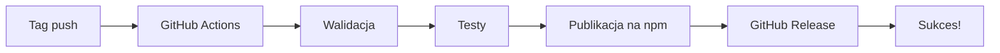

# 🚀 Konfiguracja Automatycznego Publikowania na npm

## Przegląd

Ten workflow automatycznie publikuje pakiet `opencode-autopm` na npmjs.org zawsze, gdy na GitHubu zostanie utworzony nowy release (tag w formacie `v*.*.*`).

---

## 📋 Wymagane kroki konfiguracji (jednorazowe)

### Krok 1: Utwórz npm Automation Token

1. Zaloguj się na https://www.npmjs.com
2. Przejdź do: Access Tokens → Tokens
3. Kliknij "Create New Token"
4. Wybierz typ: **Automation**
5. Nadaj tokenowi nazwę: `GitHub Actions - opencode-autopm`
6. Ustaw uprawnienia: **Automation** lub **Full Access**
7. Kliknij "Create Token"

**⚠️ WAŻNE**: Skopiuj wygenerowany token - nie będziesz go mógł zobaczyć ponownie!

Token będzie wyglądać tak: `npm_XXXXXXXXXXXXXXXXXXXXXXXXXXXXXXXX`

---

### Krok 2: Dodaj NPM_TOKEN do GitHub Secrets

1. Otwórz repozytorium na GitHub
2. Przejdź do: **Settings** → **Secrets and variables** → **Actions**
3. Kliknij "New repository secret"
4. Wypełnij pola:
   - **Name**: `NPM_TOKEN`
   - **Secret**: Wklej swój npm automation token (od `npm_` do końca)
5. Kliknij "Add secret"

**✅ Sekret NPM_TOKEN jest teraz skonfigurowany!**

---

## 🔄 Jak to działa?

### Automatyczny proces (przy utworzeniu release)



### Ręczne uruchomienie

Możesz też uruchomić workflow ręcznie z GitHub UI:

1. Przejdź do: **Actions** → **Release to npm**
2. Kliknij "Run workflow"
3. Wybierz branch i wersję
4. Kliknij "Run workflow"

---

## 📝 Proces tworzenia release

### Sposób 1: Przez Git (automatyczny po push)

```bash
# 1. Zatwierdź zmiany
git add .
git commit -m "feat: new feature"

# 2. Utwórz tag (to uruchamia automat workflow)
git tag v3.7.1

# 3. Push tag (to uruchamia workflow)
git push origin v3.7.1
```

**Workflow zostanie automatycznie uruchomiony!**

### Sposób 2: Przez GitHub UI (ręczny trigger)

1. Przejdź do repozytorium na GitHub
2. Kliknij **Actions** → **Release to npm**
3. Kliknij **Run workflow**
4. Wpisz wersję: `v3.7.1`
5. Kliknij **Run workflow**

---

## 🛡️ Zabezpieczenia

Workflow zawiera walidację:

1. ✅ Sprawdza czy package.json ma nazwę `opencode-autopm`
2. ✅ Uruchamia wszystkie testy (`npm run test:all`)
3. ✅ Waliduje pakiet przed publikacją (`npm pack --dry-run`)
4. ✅ Publikuje z provenance (npm --provenance)
5. ✅ Weryfikuje publikację na npm
6. ✅ Automatycznie tworzy GitHub Release

---

## 📊 Status publikacji

### Śledź w czasie rzeczywistym:

1. **GitHub Actions**: 
   - Przejdź do **Actions** → **Release to npm**
   - Zobaczysz postęp każdego kroku

2. **npm Registry**:
   - Po kilku minutach: https://www.npmjs.com/package/opencode-autopm
   - Sprawdź wersję w sekcji "Versions"

3. **GitHub Release**:
   - Przejdź do: https://github.com/rafeekpro/OpenCodeAutoPM/releases
   - Release zostanie automatycznie utworzony

---

## ⚙️ Dostosowanie workflow

### Zmiana wersji Node.js

W pliku `.github/workflows/release.yml`:

```yaml
- name: Setup Node.js
  uses: actions/setup-node@v4
  with:
    node-version: '20'  # Zmień tę linię
```

### Dodatkowe kroki przed publikacją

Możesz dodać własne kroki w sekcji `validate`:

```yaml
validate:
  steps:
    # ... istniejące kroki ...
    
    - name: Custom validation
      run: |
        echo "Running custom checks..."
        # Twoje własne komendy
```

---

## 🐛 Rozwiązywanie problemów

### Problem: "NPM_TOKEN not found"

**Rozwiązanie**: Upewnij się, że dodałeś secret NPM_TOKEN do GitHub:
- Settings → Secrets and variables → Actions → NPM_TOKEN

### Problem: "401 Unauthorized" przy publikacji

**Rozwiązanie**: Token npm może być nieważny lub nie ma odpowiednich uprawnień:
- Sprawdź: https://www.npmjs.com/settings/tokens
- Utwórz nowy token z uprawnieniami "Automation"

### Problem: "Package already exists"

**Rozwiązanie**: Wersja już istnieje na npm:
- Zwiększ wersję w package.json
- Usuń istniejący tag lokalnie: `git tag -d v3.7.0`
- Utwórz nowy tag: `git tag v3.7.1`

### Problem: "Tests failed"

**Rozwiązanie**: Testy nie przechodzą:
- Uruchom lokalnie: `npm test`
- Napraw błędy
- Commituj poprawki
- Spróbuj ponownie

---

## 📚 Przykładowy workflow

### Cały proces od developmentu do publikacji

```bash
# 1. Rozwój
npm run pm:maintain

# 2. Testy
npm test

# 3. Commit
git add .
git commit -m "feat: amazing new feature"

# 4. Tag (automatycznie publikuje!)
git tag v3.8.0
git push origin main
git push origin v3.8.0

# 5. Zobacz status na GitHub
# Actions → Release to npm → zobacz workflow
```

---

## ✅ Weryfikacja po publikacji

Po udanej publikacji sprawdź:

```bash
# 1. Zainstaluj nową wersję
npm install -g opencode-autopm@latest

# 2. Sprawdź wersję
opencode-autopm --version

# 3. Sprawdź na npm
open https://www.npmjs.com/package/opencode-autopm

# 4. Sprawdź GitHub release
open https://github.com/rafeekpro/OpenCodeAutoPM/releases
```

---

## 🎉 Gotowe!

Teraz za każdym razem gdy utworzysz nowy tag (np. `git tag v3.7.1 && git push origin v3.7.1`), GitHub Actions automatycznie:

1. ✅ Przetestuje kod
2. ✅ Opublikuje na npm
3. ✅ Utworzy GitHub Release
4. ✅ Powiadamia o sukcesie lub błędach

**Całkowicie automatycznie! 🚀**

---

*Last updated: 2025-02-27*  
*Version: 3.7.0*
